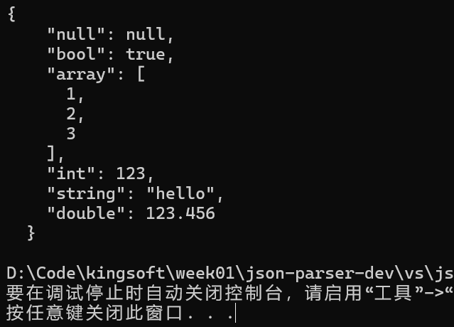
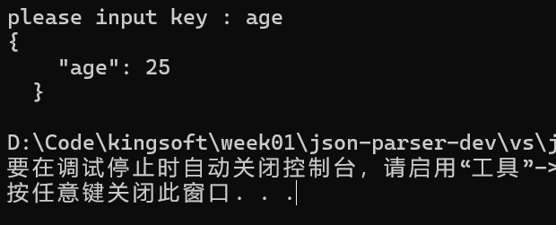
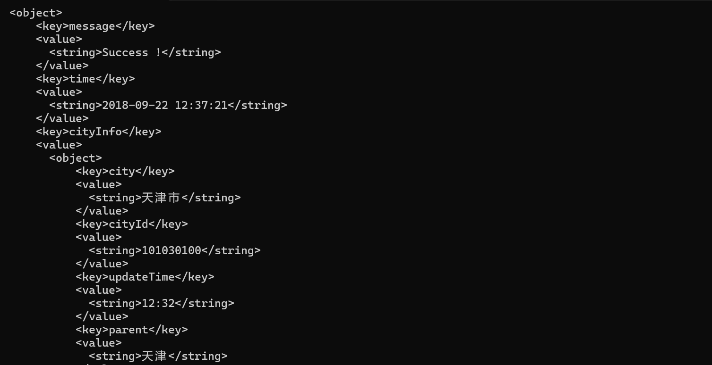
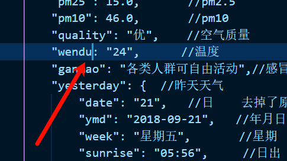
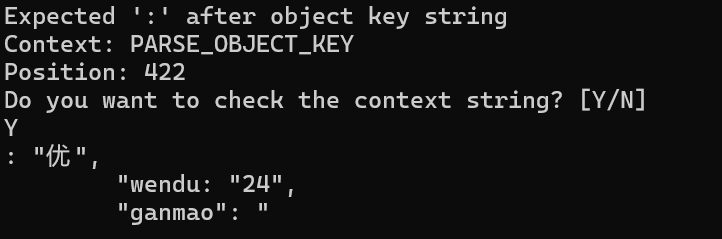

###  文件说明

```tree
 json-parser-dev
├── KJson.cpp
├── KJson.h
├── README.md
├── assert
├── dev-log.md
├── json_ori.cpp
└──test.cpp
```

- KJson.h & KJson.cpp: Json类的声明与定义，命名空间为KJson::。
- assert: 用于测试的两个json文件，其中`citm_catalog.json`代表较大，较复杂的json文件。
- dev-log.md：完成该项目时遇到的一些困难以及一些功能设计时的思路历程。
- json_ori.cpp：初版使用递归下降实现的轻量化json类。

### 功能验证

1. 基础功能实现

   字符串，整数，浮点数，布尔值，空值（`null`），对象（嵌套JSON对象），数组（支持嵌套数组）。

   

   ```cpp
   void Test_KJson_type()
   {
       KJson::Json j;
       j.insert("null",KJson::Json());
       j.insert("bool",KJson::Json(true));
       j.insert("int",KJson::Json(123));
       j.insert("double",KJson::Json(123.456));
       j.insert("string",KJson::Json("hello"));
       KJson::Json arr(KJson::JSON_ARRAY);
       arr.push_back(KJson::Json(1));
       arr.push_back(KJson::Json(2));
       arr.push_back(KJson::Json(3));
       j.insert("array",arr);
       std::cout<<j.to_pretty_string(1)<<std::endl;
   }
   ```

2. 动态键名

   

   ```cpp
   void Test_KJson_dynamic()
   {
       KJson::Json userInfo(KJson::JSON_OBJECT);
       std::string key;
       std::cout << "please input key : " ;
       std::cin >> key;  //生成动态键名
       userInfo[key] = 25;  //生成键值对
       std::cout << userInfo.to_pretty_string(1) << std::endl;
   }
   ```

3. XML序列化

   

   ```cpp
   void Test_KJson_XML()
   {
       KJson::Json j;
       std::string jsonStr;
       std::ifstream file("D:\\Code\\kingsoft\\week01\\json-parser-dev\\assert\\input_json.txt");
       if (file.is_open()) {
           std::stringstream buffer;
           buffer << file.rdbuf();
           jsonStr = buffer.str();
           file.close();
       } else {
           std::cerr << "无法打开文件" << std::endl;
       }
       std::string processedJson = removeComments(jsonStr);
       j.parseStr(processedJson);
       std::cout << j.to_XML(1) << std::endl;
   }
   ```

### 其他说明

#### 基本设计

此`Json`类设计采用`enum`作为内部变元`_type` ,`union`作为内部变元`_value`,通过STL中的`vector`支持json的array类型，通过`unordered_map`支持json的object类型。构造函数接收左值时采用**深拷贝**方式获得完整的资源占有权，接收右值时采用移动语义交换资源。

#### Parser整体设计

设计思路流程为递归下降 -> 设计基础解析函数-> 通过模拟栈方式实现非递归。

进一步而言，递归下降的方式是始终维护一个`_pos`索引值指示当前的解析进度，采用下层函数如`parse_null`, `parse_number`等解析出子json对象填充到复杂的父json对象中，逐级返回，在最外层得到解析的结果。

在非递归实现中，使用模拟栈的方式模拟递归过程，将当前解析状态上下文存储在stack中，就最终效果而言，可类比为**有限状态机**模型，将整个解析流程分解为：

- PARSE_VALUE：用于解析基本类型，单独的null，bool，number，string。
- PARSE_OBJECT_KEY: 用于解析object的string key，尝试获取下一个key，是解析object类型的入口状态和出口状态。
- PARSE_OBJECT_VALUE: 用于解析object的value，由于value无限制，可能进入其他子状态。
- PARSE_ARRAY_VALUE: 类似前者，解析array的value。

而解析上下文则由该数据结构进行维护

```cpp
struct ParseContext {
    ParseState state;
    Json* json;
    std::string key;  // 用于对象的键
    ParseContext(ParseState s, Json* j) : state(s), json(j) {}
};
```

通过这个状态机模型，实质上完成了抽象语法树的构建，为异常处理提供帮助，进一步实现更合理的错误提示功能。

#### PARSER的异常处理和错误提示

由于PARSER的整体框架为外层状态机保存上下文和子函数解析基本类型，所以设计逐层的异常传递，在最内层根据各具体实现函数抛出当前解析错误的语义，如`parse_number`过程中的`int out of range`，而外层接收到此异常后加入_pos信息和context信息，进一步指示错误出现在状态机的哪个流程中，如此，包含完整错误提示的异常在最外层的parse函数中被catch，完成资源的清理后将错误提示string输入cerr中。

由于在开发流程中，单单一个_pos指示不太能提示到当前错误在原字符串中的位置，故而给出用户一个选择输出`_str.substr(_pos-30, 60)`的前后30字符，使用起来方便许多。

最终效果如图：

<div style="display: flex; align-items: center; gap: 10px;">
    
    
</div>
这种提示效果还是相当不错的，事实上我也是通过这种提示测算benchmark过程中发现int out of range错误才发现该json采用int存放时间戳，以及string中含有转义字符，进而促使我重构parse_string函数。

#### Benchmark


与颇负盛名的开源库 [Jsoncpp](https://github.com/open-source-parsers/jsoncpp) 进行了比较

测试设备 i7-12700H(20CPUs) 测试对象 [citm_catalog.json](https://github.com/RichardHightower/json-parsers-benchmark/blob/master/data/citm_catalog.json) 

> A big benchmark file with indentation used in several Java JSON parser benchmarks.

可以看到, 该parser还有很大的优化空间。

#### 其他

- string的解析过程也使用了状态机的思想，设置了状态NORMAL和ESCAPED，遇到\转义符进入解析转义字符状态。
- 前期的思考和尝试耗费颇久，可见dev-log，cpp的一些特性是现学现用，实际上有些设计仍然可以优化，如std::variant替换union，std::string_view的使用，from_chars的使用等等，时间不足，没有对这些部分进行重构。

- API设计看起来没那么合理，但是我觉得具体使用可能得切合一个业务场景进行设计，举例来说，向一个非array的json调用push_back是应该清除原json中的内容然后将其当做空array进行插入，还是应该直接抛出类别不符的异常？有时我们需要动态类型，有时我们需要强类型检查。
- 另外，性能比不上jsoncpp，可能是多线程优化，alocator重写等等问题。
- 完整的commit记录在https://github.com/Ideenaster/json-parser-dev
